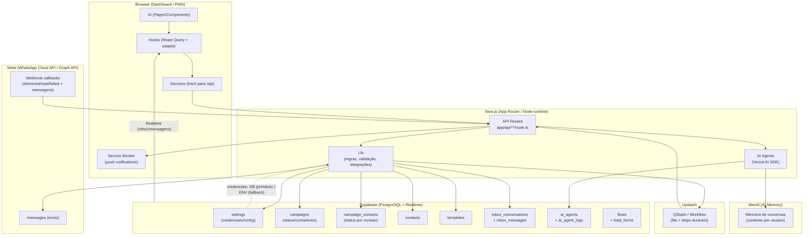
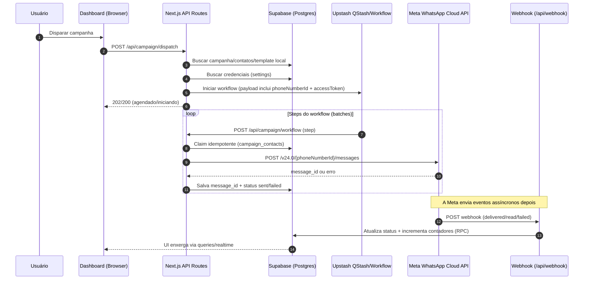
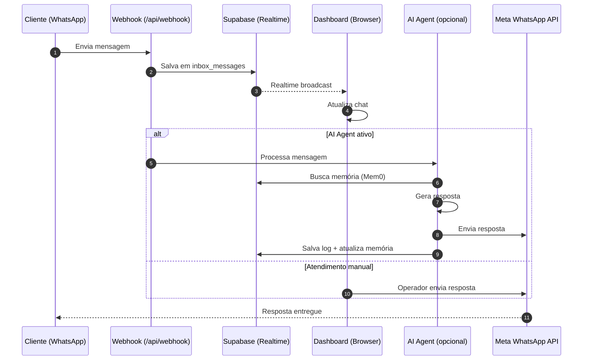
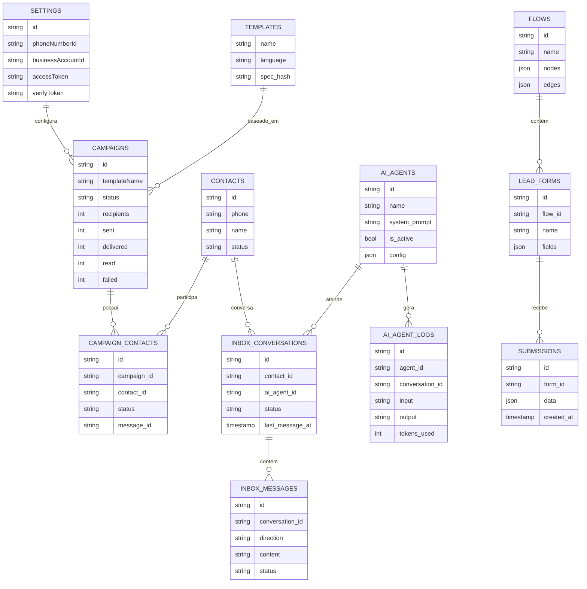

# SmartZap v1.0.0 (SaaS de automação WhatsApp)

<div align="center">


CRM + automação de campanhas no WhatsApp (Cloud API), com inbox em tempo real, agentes de IA e fila/workflows (Upstash QStash).

<p align="center">
   <a href="docs/GUIA_CONFIGURACAO.md">
      
   </a>
</p>

</div>

---

## Navegação rápida

- **Guia (produção)**: [docs/GUIA_CONFIGURACAO.md](docs/GUIA_CONFIGURACAO.md)
- **Guia (local / dev)**: [docs/GUIA_DE_INSTALACAO.md](docs/GUIA_DE_INSTALACAO.md)
- **Arquitetura**: [UI → API → filas → Meta → webhook → DB](#arquitetura-primeiro-como-tudo-se-conecta)
- **Rodar local**: [Como rodar localmente](#como-rodar-localmente)
- **Docs internas**: [Documentação](#documentação)

> [!IMPORTANT]
> Segurança: não comite segredos. Se você for adicionar prints na pasta `docs/`, use imagens sanitizadas (existe `scripts/redact_docs_images.py` e `scripts/scan-secrets.mjs`).

## TL;DR (como começar)

Escolha seu caminho:

### Produção (recomendado: Vercel + Wizard)

- Siga o guia completo: **[docs/GUIA_CONFIGURACAO.md](docs/GUIA_CONFIGURACAO.md)**
- Você vai usar o Wizard em `/install/start` para configurar Supabase + QStash (+ WhatsApp opcional).

### Local (dev)

- Siga o guia rápido: **[docs/GUIA_DE_INSTALACAO.md](docs/GUIA_DE_INSTALACAO.md)**
- Em geral: instalar deps → `.env.local` → `npm run dev`.

> [!TIP]
> Se você for rodar o Wizard em produção, prefira o domínio principal `https://SEU-PROJETO.vercel.app` (Production) — não o link de Preview.

## O que é

O SmartZap é uma plataforma full-stack (Next.js App Router) para automação de WhatsApp que permite:

- gerenciar **contatos** e campos personalizados;
- visualizar/sincronizar/criar **templates** do WhatsApp;
- criar e disparar **campanhas** (envio em massa) com pré-validação;
- acompanhar **métricas** e alertas de conta;
- configurar integrações (Supabase, Meta, Upstash, IA) via wizard ou variáveis de ambiente.

## Features Principais

| Feature | Descrição |
|---------|-----------|
| 📋 **Campanhas** | Envio em massa com templates, pré-validação e métricas em tempo real |
| 💬 **Inbox** | Chat em tempo real com clientes via WhatsApp |
| 🤖 **AI Agents** | Agentes de IA configuráveis para atendimento automatizado |
| 🧠 **Mem0** | Memória persistente de conversas para contexto personalizado |
| 📝 **Lead Forms** | Formulários de captura embeddáveis |
| 📱 **PWA** | App instalável com suporte a push notifications |
| 👥 **Contatos** | CRM completo com campos personalizados e segmentação |
| 📊 **Templates** | Sincronização e gerenciamento de templates do WhatsApp |

> [!NOTE]
> Este repositório também é usado como base educacional. A pasta `tmp/` pode conter materiais extras e utilitários.

## Stack

- **Frontend**: Next.js 16, React 19, Tailwind CSS v4, shadcn/ui + Radix
- **Backend**: API Routes (Next.js, runtime Node.js) + integrações externas
- **Banco**: Supabase (PostgreSQL + Realtime)
- **Fila/Workflows**: Upstash QStash (steps duráveis)
- **IA**: Vercel AI SDK v6 (Gemini/OpenAI/Anthropic) + Mem0 (memória de conversas)
- **WhatsApp**: Meta WhatsApp Cloud API (Graph API v24+)
- **PWA**: Service Worker + Push Notifications (web-push)

## Arquitetura (primeiro: como tudo se conecta)

Esta seção existe para responder rapidamente:

- **quem chama quem** (UI → API → filas → Meta → webhook → DB → UI)
- **onde cada dado mora** (o que é fonte da verdade vs cache)
- **onde ficam as integrações** (Supabase, Upstash/QStash, Meta)

> O GitHub renderiza Mermaid em Markdown usando blocos ` ```mermaid `.

### Mapa de serviços (UI → Next.js → Upstash → Meta → Supabase)



<details>
  <summary><strong>Fluxo de campanha (do clique ao webhook)</strong></summary>



</details>

<details>
  <summary><strong>Fluxo do Inbox (chat em tempo real)</strong></summary>



</details>

<details>
  <summary><strong>Modelo mental do banco (o que persiste)</strong></summary>

O banco possui três grupos principais de tabelas:

1. **Campanhas**: `campaigns` → `campaign_contacts` (por contato, com `message_id`)
2. **Inbox**: `inbox_conversations` → `inbox_messages` (chat em tempo real)
3. **AI**: `ai_agents` → `ai_agent_logs` (agentes e histórico)



</details>

### Como navegar no código (Page → Hook → Service → API)

### Padrão de frontend (Page → Hook → Service → API)

Em geral, as telas seguem o padrão:

- `app/(dashboard)/**/page.tsx`: página “fina” que apenas conecta dados/handlers.
- `hooks/**`: controller hooks (React Query + estado de UI).
- `services/**`: client de API (fetch para rotas em `app/api/**`).
- `app/api/**/route.ts`: rotas server-side (validação, DB, integrações).

### Pastas principais

```txt
app/
├── (auth)/
│   ├── login/              # Página de login
│   └── install/            # Wizard de instalação (start, steps, success)
├── (dashboard)/
│   ├── campaigns/          # Campanhas (lista, detalhes, criação)
│   ├── contacts/           # Gestão de contatos
│   ├── templates/          # Templates do WhatsApp
│   ├── inbox/              # Chat em tempo real
│   ├── settings/           # Configurações
│   │   └── ai/             # Central de IA (agentes, memória)
│   └── ...
├── api/                    # API Routes (28+ endpoints)
│   ├── webhook/            # Webhook do WhatsApp
│   ├── inbox/              # APIs do Inbox
│   ├── ai-agent/           # APIs dos AI Agents
│   ├── campaign/           # APIs de campanha
│   └── ...

components/
├── features/               # Componentes por feature
│   ├── campaigns/          # Views de campanha
│   ├── inbox/              # Chat UI
│   ├── ai-agents/          # Configuração de agentes
│   └── onboarding/         # Wizard de instalação
├── ui/                     # shadcn/ui components

hooks/                      # Controller hooks (React Query)
services/                   # Camada de acesso às APIs
lib/
├── ai/                     # Sistema de IA
│   ├── agents/             # Lógica dos agentes
│   ├── mem0-client.ts      # Cliente Mem0
│   └── embeddings.ts       # Embeddings
├── whatsapp/               # Integração WhatsApp
└── ...

supabase/migrations/        # Migrations SQL (31+ arquivos)
scripts/                    # Scripts utilitários
```

> [!NOTE]
> Pastas `workflows/`, `flows/`, `builder/` existem mas são features beta em desenvolvimento.

## Como rodar localmente

> [!TIP]
> Quer o caminho mais curto para rodar local? Siga: **[docs/GUIA_DE_INSTALACAO.md](docs/GUIA_DE_INSTALACAO.md)**.

<details>
   <summary><strong>Ver passo a passo completo (local)</strong></summary>

### Pré-requisitos

- Node.js 20+ (recomendado)
- Conta no Supabase (para o banco)
- Conta no Meta (WhatsApp Cloud API) para uso real
- Conta no Upstash (QStash) para disparos em lote

### 1) Instalar dependências

```bash
npm install
```

### 2) Configurar variáveis de ambiente

Copie o arquivo de exemplo:

```bash
cp .env.example .env.local
```

Preencha os valores no `.env.local`. O arquivo `.env.example` já descreve cada variável.

Principais variáveis (resumo):

- **Supabase**: `NEXT_PUBLIC_SUPABASE_URL`, `NEXT_PUBLIC_SUPABASE_PUBLISHABLE_KEY`, `SUPABASE_SECRET_KEY`
- **WhatsApp Cloud API**: `WHATSAPP_TOKEN`, `WHATSAPP_PHONE_ID`, `WHATSAPP_BUSINESS_ACCOUNT_ID`
- **Webhook (verify token)**: preferencialmente via Supabase settings (`webhook_verify_token`) e, como fallback, `WEBHOOK_VERIFY_TOKEN`
- **Fila**: `QSTASH_TOKEN`
- **Segurança local**: `MASTER_PASSWORD`, `SMARTZAP_API_KEY`, `SMARTZAP_ADMIN_KEY`
- **IA (opcional)**: `GEMINI_API_KEY` (ou chaves de OpenAI/Anthropic)

### 3) Subir o servidor

```bash
npm run dev
```

Abra `http://localhost:3000`.

</details>

## Uso (fluxo recomendado)

1. Faça login (senha definida em `MASTER_PASSWORD`).
2. Vá em **Configurações** e conecte:
   - Supabase (se ainda não estiver configurado)
   - WhatsApp Cloud API
   - QStash (para campanhas)
   - IA (opcional)
3. Importe contatos (CSV) ou cadastre manualmente.
4. Sincronize/crie templates.
5. Crie uma campanha e rode o **precheck** antes do disparo.

## Comandos úteis

```bash
# Desenvolvimento
npm run dev                 # Dev server (Turbopack)
npm run dev:with-ngrok      # Dev com túnel (para webhook)
npm run lint                # ESLint
npm run build               # Build de produção

# Testes unitários (Vitest)
npm run test                # Rodar testes
npm run test:watch          # Watch mode
npm run test:ui             # Vitest UI dashboard
npm run test:coverage       # Coverage report

# Testes E2E (Playwright)
npm run test:e2e            # Playwright E2E
npm run test:e2e:ui         # Playwright interactive UI
npm run test:e2e:headed     # E2E com browser visível

# Combinados
npm run test:all            # Unit + E2E
```

## Deploy

O deploy padrão é na Vercel.

- Configure as variáveis de ambiente na Vercel (pode usar o wizard do app).
- Rode build para validar: `npm run build`.

## Troubleshooting

### "Supabase not configured. Complete setup at /install/start"

As variáveis do Supabase não estão preenchidas (ou estão incorretas). Confira:

- `NEXT_PUBLIC_SUPABASE_URL`
- `NEXT_PUBLIC_SUPABASE_PUBLISHABLE_KEY` (publishable/anon)
- `SUPABASE_SECRET_KEY` (service role/secret — backend apenas)

### Erros de permissão/#200 no Meta

Geralmente indica token sem permissões adequadas. Verifique se o token tem as permissões:
- `whatsapp_business_messaging`
- `whatsapp_business_management`

### Rate limit por par (131056)

Isso acontece quando o envio para o mesmo destinatário ocorre rápido demais. O projeto inclui tratamento e tempos de espera recomendados (backoff exponencial).

### AI Agent não responde

1. Verifique se o agente está **ativo** em Configurações > IA
2. Confira se a `GEMINI_API_KEY` (ou outra chave de IA) está configurada
3. Verifique os logs em Configurações > IA > Logs do Agente

### Webhook não recebe mensagens

1. Verifique se o webhook está configurado no Meta Business Suite
2. A URL deve ser `https://seu-dominio.com/api/webhook`
3. O verify token deve coincidir com o configurado no app
4. Teste com: `curl https://seu-dominio.com/api/webhook?hub.verify_token=SEU_TOKEN&hub.challenge=test&hub.mode=subscribe`

### Push notifications não funcionam

1. PWA precisa estar instalado (não funciona no browser comum)
2. Verifique se `NEXT_PUBLIC_VAPID_PUBLIC_KEY` está configurada
3. O usuário precisa aceitar as notificações quando solicitado
4. Em iOS, o PWA precisa ser adicionado à tela inicial

---

## Documentação

Além deste README, consulte os guias específicos:

### Configuração e Instalação
- [Guia de Configuração (Produção)](docs/GUIA_CONFIGURACAO.md) - Setup completo para produção
- [Guia de Instalação (Local)](docs/GUIA_DE_INSTALACAO.md) - Setup para desenvolvimento
- [Wizard de Instalação](docs/INSTALLATION_WIZARD.md) - Documentação do wizard

### Features
- [Inbox e AI Agents](docs/inbox-ai-agents.md) - Chat em tempo real e agentes de IA
- [Integração Mem0](docs/MEM0_INTEGRATION.md) - Memória persistente de conversas

### Referência
- [Changelog](docs/changelog.md) - Histórico de alterações

